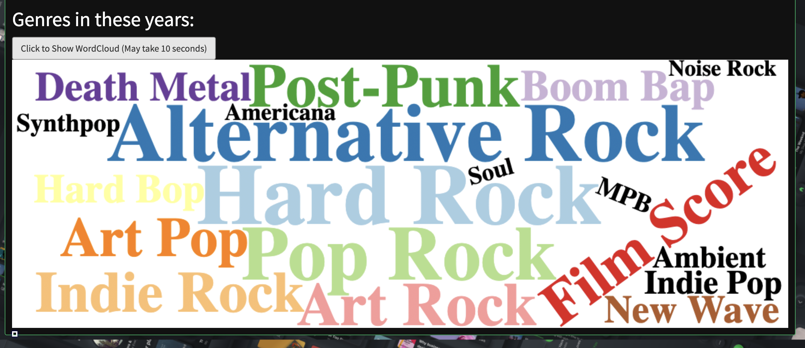
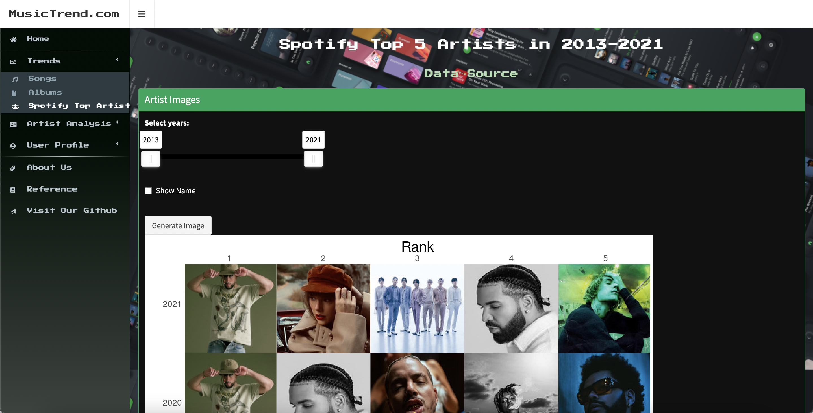

# Audio Feature Analysis For Spotify Music
### BU.520.650.51.SU22 Data Visualization Group Project
Group members: Yikai Jin, Renrong Liu, Yue Pan, Ruizhi Xu, Junzhe Zhu

In this project, our group developed an interactive R Shiny Application to show the audio features of Soptify music in three perspectives: global trend, artist and the user. You can find detailed introductions of our project and Spotify API on the Home Page of our application.
In this README file, we want to address that obtain Spotify API data requires an access token authorized by applying for a Spotify API client ID and secret. Given that our application is still under "development mode", our access token is bind to a traffic limitation. This means it is ideal for our users to apply for their own access token to fully access our application. We understand that it may be not very user friendly, so we also provide a sample client ID and a sample client secret for you to get the access token (at the cost of unable to see your personal music data in "User Profile" tab). If you still feel it is somewhat troublesome, we provide follwing screenshots to exhibit all contents that requires an access token to show:

